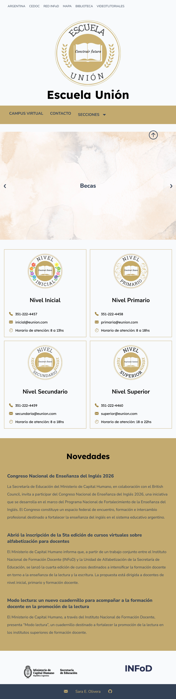
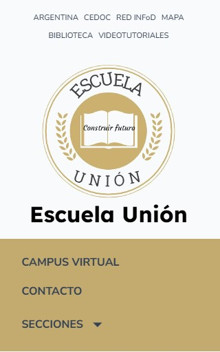
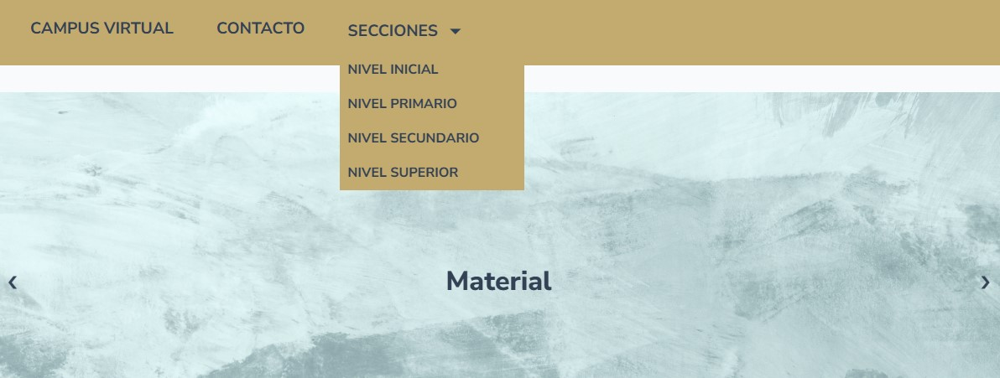

#Sitio web de un colegio

##Descripción:

Se presenta un sitio web básico de un colegio, desarrollado como práctica para afianzar y aplicar conocimientos de desarrollo web. 

##Objetivo:
El proyecto tiene como objetivo fortalecer conocimientos de desarrollo web a través del desarrollo de un sitio responsive utilizando lenguajes como HTML, CSS y JavaScript. 

##Tecnologías empleadas:
- **HTML:** estructura del sitio
- **CSS:** estilo y la adaptación responsive
- **JavaScriptL:** lógica e interactividad del navegador. 

##Funcionalidades:
 
El sitio cuenta con
  - Menú desplegable para acceder a las diferentes secciones.
  - Carrusel automático con enlaces a sitios de interés para los estudiantes. 
  - Controles manuales para navegar entre los diferentes elementos del carrusel. 
  - Cards con información sobre los diferentes niveles del colegio
  - Sección de novedades con noticias destacadas y sus enlaces correspondientes. 
  - Botón para volver al inicio de la página. 
  - Diseño responsive para diferentes pantallas.

##Responsive:

El sitio se diseñó con un enfoque **desktop-first** y se adapta a diferentes tamaños de pantallas, desde monitores de más de 1200 px hasta dispositivos de hasta 320 px de ancho. 

##Cómo ejecutar:

Descargar o clonar los archivos y ejecutar el archivo “index.html” en cualquier navegador. 

##Capturas:

### Vista completa

### Vista del inicio

### Vista del carrusel y menú desplegable

